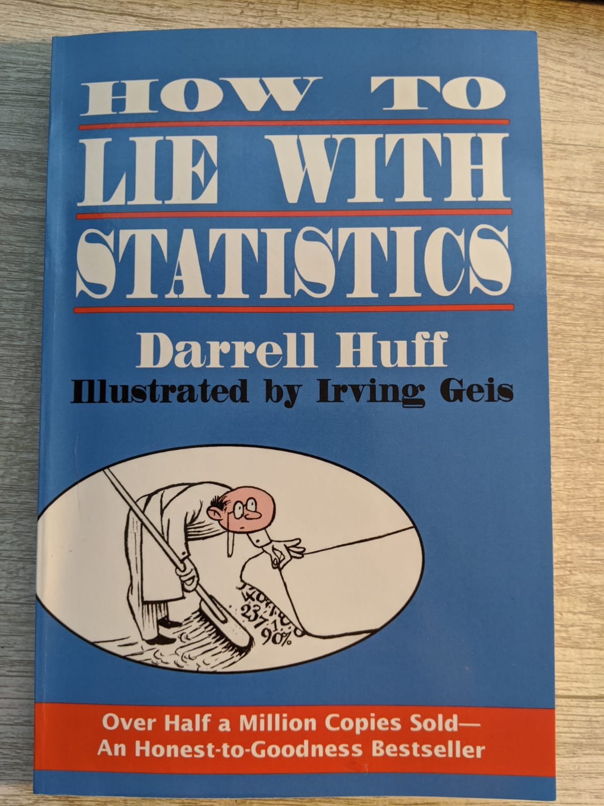
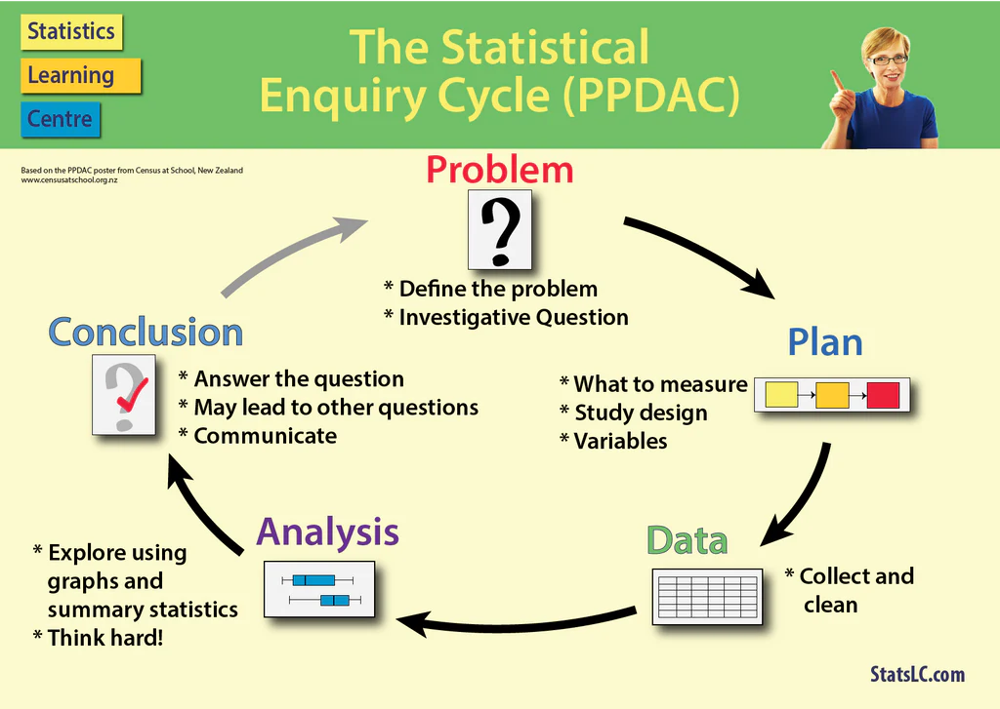
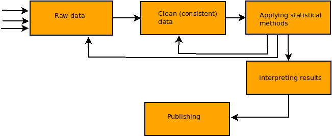

## The problem with statistics

**Lies, damned lies, and statistics**

The above well known quotation is attributed to Benjamin Disraeli (UK Prime Minister)

## How to lie with statistics

Less known book by Darrell Huff (142 pages/a5)

https://www.gatesnotes.com/About-Bill-Gates/Summer-Books-2015?WT.mc_id=05_19_2015_SummerBooks_GeekWire

BTW: this photo (taken in 2015) coupled with the fact that Gates funded the
epidemiology research at John Hopkins University has become "evidence"
for various morons (of which the are plenty in the USA),
that Gates was behind the COVID19 pandemic

A book written by Darrell Huff in 1954 presenting an introduction to
statistics for the general reader.
Not a statistician, Huff was a journalist [...]
     
In the 1960/1970s, it became a standard textbook introduction to
the subject of statistics for many college students [...]
one of the best-selling statistics books in history.

https://en.wikipedia.org/wiki/How_to_Lie_with_Statistics

The book consists of 10 chapters and is written in a provocative,
way (unscientific). Individual chapters are so well known that
if you enter the title of the chapter into google will return
hundreds of thousands references

ch1: The Sample with the Built-in Bias (ie it is very difficult to draw
     unbiased/perfect random sample) 

ch2: The Well-Chosen Average. You can manipulate average value in various ways:
     using various averages/using different definitions of averaged units/measuring
     in various ways

ch3: The Little Figures That Are Not There (Figures = Details)
     Reporting results w/o context or important information in short

ch4: Continuing #ch3 insignificant results = difference is of no practical meaning.

ch5: The Gee-Whiz Graphs (Statistical graphs
     in cartesian coordinates with OY axis not starting from zero)
     https://en.wikipedia.org/wiki/Gee_Whiz →
     https://en.wikipedia.org/wiki/Misleading_graph

ch6: The One-Dimensional Picture  (comparing 1D quantities  using 2D or pseudo-3D)
     https://thejeshgn.com/2017/11/17/how-to-lie-with-graphs/

ch7: The Semiattached Figure.
     Using one thing as a way to claim proof of something else, 
     even though there's no correlation between the two (not attached)
     https://www.secjuice.com/the-semi-attached-figure/

ch8: Post Hoc Rides Again (Correlation is not causation)

ch9: Misinforming people by the use of statistical material 
     might be called statistical manipulation, in a word, **Statisticulation**.
     (summary of ch1--ch8)

ch10: How to Talk Back to a Statistic
     (How not to be deceived)

Who Says So? (interested parties can be unreliable; car seller reputation is poor);
     
How Does He Know? (measurement is often unreliable);
     
What’s Missing? (incomplete analysis signals bias);
     
Many figures lose meaning because a comparison
is missing. In Poland there was a public discussion about falling fertility--
women in Poland do not give birth to children; the average age of a mother at the birth
of her first child is 27 years. [It is a norm in a whole Europe]

Did Somebody Change The Subject? (beware of the Semiattached Figure)
     
Does It Make Sense? (forget about statistics and think about common sense)

Despite its mathematical base, statistics is a much an art as it is a science (Huff p. 120)

## Is it better now?

Unfortunatelly quite opposite...

Misleading statistical analyzes are still doing quite well if not better than in Huff's times,
which is probably due to the following factors:

* the number of statisticians has increased exponentially, often amateurs (everyone
  can count something easily today)

* the amount of readily available data has increased exponentially too

## Fake news hype

Numbers disguised as a result of a statistical analysis are often used to persuade
something to somebody. Statistical charts are ubiquitous now and many of them are fake...

Why people believe in numbers uncritically?

They believe as they are **innumerate**. 
Why people are innumerate? 

People are illiterate because they failed to learn how to read and write. 
Simple...

Perhaps people are innumerate
not because of **genetic load** or some other disaster,
but simply becuase they are not educated?

## Statistical value chain

Four stages of statistical data analysis:

a Statistical Value Chain (SVC) is a part of SEC, namely
contains Data/Analysis/Conclusions stages:

Value chain refers to activities involved in **adding value** to the product at each stage of its processing, 
from inception to distribution and beyond

cf https://en.wikipedia.org/wiki/Value_chain

Statistical VC adds value to data

## Pitfals of teaching statistics

In my opinion based on personal experience (years of lecturing at Economics departments):

* starting from clean data 

* focusing on intricaties of statistical methods

* almost omitting everything elese

Omitting stage one results in excessive trust in statistics which is regarded as part of math and
thus 100% reliable while in reality it is not. 

Omitting stage five results in inability to read or to communicate
the results of statistical analyses.

**Less theory, more practice with data, and common sense**.

## Statistics in 3 words

data + procedures (theory of statistics) + tools

### Data

Messy and unreliable

Usually complicated

Not clean (needs extra effort before can be analysed)

### Procedures

you know them too well :-)

### Tools

**spreadsheets (Excel)**

store data + transform data + apply procedures + copy/paste results

Actually not complete statistics program. What is missing:

* lack of build-in missing value

* many procedures are unavailable (ANOVA for example) 
  or cumbersome to use
  (chi-squared test of independence for example)

* poor accuracy/unreliable results

* Poor automation. Usually one have to do a lot 
  of manual copy-pasting and/or mouse clickig/moving

Rule of thumb: sufficient for economical statistics; unsufficient
for other domains. IMO: **the sooner someone learns something else, the better**

**SPSS/JASP**

SPSS is commercial and expensive/JASP is free.
Psychology/sociology oriented

**Gretl**

Econometrics (open software)

## Reproducible research or how to make statistical computations more meaningfu
    
Abandoning the habit of secrecy in favor of process transparency and
peer review was the crucial step by which alchemy became chemistry.
Eric S. Raymond, E. S. The art of UNIX programming: Addison-Wesley.

Replicability vs Reproducibility

Hot topic: google: reproducible+research = 476000 (2/6/2023)

**Replicability**: independent experiment targetting the same question
will produce a result consistent with the original study.
  
**Reproducibility**: ability to repeat
the experiment with exactly the same outcome as
originally reported

Sounds easy? But it is not. 

* To repeat the analysis one must has
access to **data** and **tools** (ie programs) and one has to know
how the analysis was performed (detailed description what was done)

* Excel is not a standard

* Reports published in scientific journals lacks data and the
description is faaaar from complete

Computational science is facing a credibility crisis: it's impossible
to verify most of the computational results presented at conferences
and in papers today. (Donoho D. et al 2009)

We can modify our 3 words definition of statistics:

## Statistics in 4 words

data + procedures (theory of statistics) + tools + analysis description

RR possible if all above is available.

But

It can be available in several forms:

## Australopithecus (Current practices)

1. Enter data in Excel/OOCalc to clean and/or make explanatory analysis.

   Use Excel for data cleaning & descriptive statistics
   Excel handles missing data inconsistently and sometimes incorrectly
   Many common functions are poor or missing in Excel

2. Import data from Spreadsheet into SPSS/SAS/Stata for serious analysis

   Use SPSS/SAS/Stata in point-and-click mode to run serious
   statistical analyses.

3. Prepare report/paper: copy and paste output to Word/OpenOffice, add
   description.

4. Publish (repeat 1--4 repeat in a year on a larger dataset).
  
Problems

Tedious/time-wasting/costly.

Even small data/method change requires
extensive recomputation effort/careful report/paper revision and update.

Error-prone: difficult to record/remember a 'click history'.

Famous example: Reinhart and Rogoff controversy
Countries very high GDP--debt ratio suffer from low growth. However the study
suffers serious but easy identifiable flaws which were discovered when
RR published the dataset they used in their analysis
(cf [Growth_in_a_Time_of_Debt](https://en.wikipedia.org/wiki/Growth_in_a_Time_of_Debt))
  
Outcome: RR in theory only
  
  
## Homo habilis (Enhanced current practices)

1. Abandon spreadsheets.

2. Abandon point-and-click mode. Use statistical scripting
   languages and run program/scripts.

Benefits

Improved: reliability, transparency, **automation**, maintanability.
Lower costs (in the long run).

Solves 1--2 but not 3--4 (Publishing).

Problems: Steeper learning curve.
Perhaps higher costs in short run.
Duplication of effort (or mess if scripts/programs are poorly documented).

## Homo Erectus (Literate statistical programming)

Literate programming concept:

**Program code and description in one document**. 

Statistical computing code is embedded inside descriptive
text. Literate statistical program is turned into
report by executing code and inserting the results obtained.

Solves 1--4.

## LSP: Benefits/Problems/Tools

* Reliability: Easier to find/fix bugs or to avoid errors when 
  repeating the [modified] analysis

* Efficiency: automated computing. Repetitive tasks are performed automatically

* Institutional memory. LSP documents are better for storage

Problems of LSP: Many incl. costs and learning curve

## LSP Tools

* Document formatting language: Rmarkdown (variant of Markdown)

* Statistical programming language: R

## There is a life without speadsheet too: R and Rstudio

R is both *programming language*  for statistical computing and graphics and 
a software (ie application) to execute programs written in R.
R was developed in mid 90s  at the University of Auckland 
(New Zealand).

Since then R has become one of the dominant software environments for data analysis and is used by a variety of scientific disiplines.

BTW why it is called so strange (R)? Long time ago it was popular to use short names for computer languages
(C for example). At AT&T Bell Labs (John Chambers) in mid 70s a language oriented towards statistical
computing was developed and called S (from Statistics). R is one letter before S in an alphabet.

Rstudio is an *environment* through which to use R. In Rstudio one can simultaneously write code, execute
code it, manage data, get help, view plots. Rstudio is a commercial product distributed
under dual-license system by RStudio, Inc. Key developer of RStudio is Hadley Wickham 
another brilliant New Zealander (cf [Hadley Wickham](https://en.wikipedia.org/wiki/Hadley_Wickham) )

Microsoft invest heavily into R development recently. It bought Revolution Analytics a key 
developer of R and provider of commercial versions of the system. With MS support the system
is expected to gain more popularity (for example 
by integrating it with popular MS products)

## Programming is difficult

True, but we are talking about scripting ie. easy programming

Programming in spreadsheet is difficult too

## Learning resources and data banks

**Learnig resources**

* [Rstudio](https://www.rstudio.com/resources/cheatsheets/)

* [Making Data Meaningful](https://www.unece.org/stats/documents/writing/)

* [bookdown: Authoring Books and Technical Documents with R Markdown](https://bookdown.org/yihui/bookdown/)

* Supplementary resources 
to my lecture (slides/data/R scripts etc) are available at:
[https://github.com/hrpunio/Z-MISC/tree/master/Erasmus/2019/Batumi](https://github.com/hrpunio/Z-MISC/tree/master/Erasmus/2019/Batumi)

**Data banks**

* [Polish Main Statistical Office](https://stat.gov.pl/)

* [Bank Danych Lokalnych (Local Data Bank)]()https://bdl.stat.gov.pl/BDL/start)

* [Eurostat (European Union Statistical Office)](https://ec.europa.eu/eurostat/data/database)

* [My github repository](https://github.com/hrpunio))

## Geo resources

* [GISCO](https://ec.europa.eu/eurostat/web/gisco/overview)

* [NUTS downolad page](https://ec.europa.eu/eurostat/web/gisco/geodata/reference-data/administrative-units-statistical-units/nuts)

* [TERYT download page](http://eteryt.stat.gov.pl/eTeryt/rejestr_teryt/udostepnianie_danych/formy_i_zasady_udostepniania/formy_i_zasady_udostepniania.aspx?contrast=default)

* [World Borders Dataset](http://thematicmapping.org/downloads/world_borders.php)

* [QGIS tutorials](https://www.qgistutorials.com/en/docs/)

* [gis.stackexchange.com](https://gis.stackexchange.com/)

