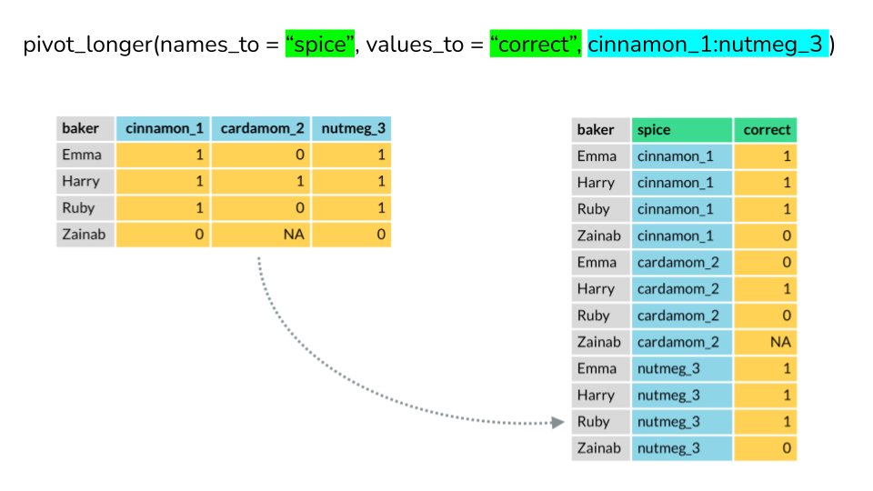

```{r setup, include=FALSE}
knitr::opts_chunk$set(echo = TRUE)
```

## The problem

First step in computer analysis is transforming data from row to
clean. This is tedious.  The best approach is to automate it with some
computer program.

Data wrangling: https://en.wikipedia.org/wiki/Data_wrangling

## Basic facts

R is a computer language. There is a computer program called R (R.exe
in MS Windows which can execute R programs (often called scripts.)

So to compute something one has to write a script using R syntax,
and then run this script with R.

Sounds scary, but you don't to be a programmer to use R.

## R vs Excel

Excel: data + functions

Load spreadsheet, apply functions to data (usually ranges)

Example: **compute mean, median and standard deviation**

Put cursor in a cell; mark region usually column; apply `mean(column)`
repeat for `median` and  `stdev`


R: otherway: functions + data (usually invisible)

Example: **compute mean, median and standard deviation**

load data from external file (`FB2020.csv`)
into something called dataframe which is an internal data structure divided
into columns similar to spreadsheet;

```
df <- read.csv("FB2020.csv")
mean(df$column); median(df$column); sd(df$column)
```

Easy?


**Difference**:

R: data invisible, program (how the data is processed) visible;
in Excell the other ways round

The bigger the dataset the more cumbersome an Excel-aproach is (IMO)

**Moreover data + functions is not the whole story**

**Meaningful data analasis: data + functions + description**

without *description* it is difficult to understand the details and
results of analysis, so:


Excel: data + functions + description

**Problem**: all is intermixed, usually if one changes the data (add more rows)
one has to modify the functions (ranges)

R: separates data/functions/descriptions

Comments (descriptions) starts from `#`; data are external
to program so functions has not to be modified if dataset is enlarged

```
# Source: https://www.forbes.com/real-time-billionaires/
df <- read.csv("FB2020.csv")
# Compute mean, median
mean(df$column); median(df$column);
# Compute standard deviation
sd(df$column)
```

Conclusion: with R data analysis is meaningful and easier

## R program execution 

The most elementary way

```
Rscript file.R
```

## Program structure (for the begginers)

A program is divided into **expressions**

Expressions consists of  **variables**, **operators** and **functions**

Variables contains values (ie data); more on that below.

Operators are `+`, `-`, `*` etc. So `x + y` is a expression
with two variables (`x` and `y`) and `+` operator in between.
As expected the meaning of the expression is add *x to y*.

Functions are similar to Excel functions, ie build-in
formulas which performs specific calculations. Functions have
*arguments* (in Excel typically ranges.)
Example `sd(x)/mean(x)` (compute standard deviation of `x`,
divide by mean of `x`.)

Comments starts from `#`, they are ignored while program
is executed

Expressions are executed sequentailly from the first to the last

## Variables

A variable can be simple (single value) or complex (many values, ie vector)

A variable have a **type** (as in Excel but in excel it is less explicit)

## Simple data types

As in all other computer languages:

numeric (ie numbers), 

characters (strings),

complex numbers (not used by economists) 

and logical(`T`/`F`)

One can assign value to variable with '<-' (assignment) operator

**Numeric type**

```
x <- 5
y <- 8
x + y # prints 13
```

Variable `x` is assigned a value of 5;
variable `y` is assigned a value of 5. Expression `x +y` is evaluated
and the resulting value printed

```
z <- x + y
```

Nothing is printed. The resulting value if assigned to `z`.

**Character type**:

```
x <- '5'
y <- "8"
x + y ## error non-numeric arguments
```

You can't perform math on non-numeric data.

In Excel such operations are often silently ignored (for example
sum of the range containing non-numeric cells is equal to total value of numeric cells--if a cell is non numeric by mistake such an error is difficult to detect)

**Logical type**

Only two values `TRUE` (abbreviated to `T`) or `FALSE` (`F`)

```
> x <- T
> x
[1] TRUE
```


### Datatype checking/conversion

`x` is a variable (aka an **object** or **name**);
object is assigned a value (5)

```
x <- 5
## str(ucture) of an object x
str(x)
num 5
x <- "5" ## lub '5'
str(x)
chr "5"
```

Note: `str` is a function. The meaning of that function is
to show the datatype of the argument (`num` means numeric; `chr` means
character)

**conversion (`as.someDataType`)**

There are useful functions to convert one datatype to another

```
y <- as.numeric(x) + 1
print (y) ## or y 

## as.character 
## as.logical
```

### Basic operations:

numbers: arythmetic (like in school): `+`, `-`, `*`, `/` etc...

strings (of characters): 

concatenation `paste(x, y, z...)`

length of string `x` `nchar(x)`

```
paste("abra", "ca", "dabra")
## no spaces inserted
paste0("abra", "ca", "dabra")

nchar(paste0("abra", "ca", "dabra"))
##or
abraC <- paste0("abra", "ca", "dabra")
nchar(abraC)

```

Note: `paste`, `paste0`, `nchar` are  functions of courese

## Data structures (complex data types)

Vectors, matrices (multi-demensional vectors), **frames** 

## Vectors

```
vector <- c(c1, c2, ...)
## example
v <- c(x, y)
```

**Slicing (getting/refering to part of vector**

```
v[i] where i is a vector of integers (indices of vector elements)

v[c(1, 2, 3)]
v[1:3]
v[seq(1, 6, by=2)]
```

**Logical vectors**

Logical vectors contains `T`/`F` only

Very useful feature for easy slicing:

```
lv <- c (T, F, F, T)
v <- c (1, 2, 3, 4)
v[lv] # returns (1,4)
```

Logical vector usually is created with
some logical statment involving existing vectors. Lets assume
`age` is a vector of ages:
    
```
age <- c(18, 45, 60, 23, 11, 55, 2)
young <- age < 24
young
[1]  TRUE FALSE FALSE  TRUE  TRUE FALSE  TRUE
```

`young` is a vector of `T/F`'s if an element of `age` was less than 24
the relevant element of `young` is `T` otherwise is `F`.


Logical operations: `&` (and), `|` (or),  `%in%` (in a set)

```
young_and_old <- age < 24 | age > 50
## returns
is_young_and_old 
[1]  TRUE FALSE  TRUE  TRUE  TRUE  TRUE  TRUE
```

**Slicing**

Vector `is_young_and_old` contains T/F values but
`age[is_young_and_old]` contains actual values for young and old:

```
age[is_young_and_old ]
[1] 18 60 23 11 55  2
```
This is useful way of filtering datasets

Another example of filtering (slicing):

```
sex <- c("m", "m", "f", "m", "f", "f")
# Which values of sex are m?
which(sex == "m")
## [1] 1 2 4
## but
sex[sex == "m"]
## or
sex[which(sex == "m")]
[1] "m" "m" "m"
```

## Missing value

Missing values are common in datasets. 

There is no build-in way of denoting missing value in spreadsheets 
(because they are not intended for serious statistical analysis);

Users invents some special marks or values for that (`x` or `-999` for example);
of course it is patchwork solution, prone to errors

Lack of build-in missing value is a **disqualifying feature** of
(or why spreadseet is spread-shit)

There is build-in missing value in R denoted as `NA` variable.

```
age1 <- NA
##is.na(x) which element is NA
is.na(age1)
[1] TRUE

## append NA to age (age contains NA now)
age <- c (age, NA)
age
[1] 18 45 60 23 11 55  2 NA

is.na(age)
[1] FALSE FALSE FALSE FALSE FALSE FALSE FALSE  TRUE

which(is.na(age))
[1] 8
## eighth is TRUE
```

In R handling of NA is explicit while in Excel it is often undocumented


###  Useful tricks

```
v[i] <- newValue

##i maybe vector or logical vector

v[6:10] <- 0
v[c(1,7,9)] <- (1,2,3)

## seq useful function
x = seq(1,5)
x[c(1,4,5)] <- c(0, -1, -2)
x
[1] 0  2  3 -1 -2

## also
seq(2, 10, by=2)
```

## Data Frames (DF)

A workhorse for statistical analysis (equivalent of spreadsheet)


### Create DF

To create a **dataframe** from vectors, use the `data.frame()`
which creates a dataframe from **named columns**:

```
df <- data.frame("name1" = c(...), "name2" = c(...), ...)
```

**Useful functions**:


`names(df)` -- return colum names

`df$c` -- returns column `c`

`df[c]` -- returns colums (`c` is character vector of column names) ie
  `df[c("c1", "c5")]`

adding columns: `df$newCol <- c(...)` creates new column `newCol` 


**Renaming column names**:

```
names(df)[1] <- "newName" ## change column one name to newName

##better way:
names(df)[names(df) == "someName"] <- "newName"

## in general: 

names(df)[c(1,3)] <- c('newC1', 'newC2')
```


### Slicing with [, ]

Just like vectors, you can access specific data in dataframes using
brackets. But now, instead of just using one indexing vector, we use
two indexing vectors: one for the rows and one for the columns. To do
this, use the notation data[rows, cols], where rows and columns are
vectors of integers.

if rows or cols blank then = all rows / all cols, ie df [r, ] or df[, c]

`n:m` sequence from n to m
`c(n,m)` vector of two elements n,m

### Slicing with logical vectors

Indexing dataframes with logical vectors is almost identical to
indexing single vectors. First, we create a logical vector containing
only TRUE and FALSE values. Next, we index a dataframe (typically the
rows) using the logical vector to return only values for which the
logical vector is TRUE.

```
df[lv, ]
```

### Conversion to DF

`is.data.frame(x)` returns `T` if x is a DF

`as.data.frame` conversion to DF (if possible)

```
x <- "Silly example"
dfx <- as.data.frame(x)

dfx
             x
1 Silly example
is.data.frame(dfx)
[1] TRUE
```

In the above silly example `dfx` is a dataframe with one colum
and one row. The column name is  `x`.


## Data import from external files 

All formats are supported (including) Excel but preferred is CSV

Typical usage (argument `na.strings` declares which value is NA):

```
## string "NA" is declared as NA
## header=T declares that first row contains variable names
## sep=";" declares that values are separated by ';'
## dec="," declares that decimal part is separated by , (continental standard)

df <- read.csv(fileName.csv, sep = ';', dec = ",",  header=T, na.string="NA");

## or

df <- read.csv(fileName.csv, sep = ';', dec = ",", 
  header=F
  col.names = c('var1', 'var2'),
 colClasses = c('factor', 'factor', 'character', 'character', 'numeric', 'numeric'));
```

`col.names` declares column names ; 

`colClasses` declares column types

This is the simples form of **loading the data** into R.

## Some useful R commands 

One can skip this on first reading :-)

One can perform pretty complex data analysis with dataframes and
build-in functions only, without user-defined functions, loops or conditional execution.

### Conditional execution

```
if (condition) statement-if-true else statement-if-false
## examples
if (x <5) print ('Mniej niż 5')
if (x <= 5) { print '5 lub mniej'} else {print '6' }
 
```

Vectorized `if`: `test`/`yes`/`no` are vectors containing equal number
of elements (equal length):

```
ifelse(test, yes, no)
```

for every element of vector `test` if this element value is `T` returns 
element from `yes` or `no` in the opposite:

```
## silly example:
test <- c(F, F)
a <- c('1', '2')
b <- c(0, 0)
ifelse(test, a, b)
[1] 0 0
```

### Loop

Rarely used. Use vector operations instead

```
for (v in sequence) { ... }
## Example
for (i in 1:10) { print(i) }
cc <- c(1,2,3)
for (c in cc ) { print (c *c)}

## or
while (test) { ... }
## Example
c <- 1; while (c < length(cc)) {print (cc[c]); c=c+1 }
```

### Functions

or why spreadseet is spread-shit again (well the latest Excel 
supports user-defined functions):


```
function_name <- function(args) { body }
```

## Packages

Packages provides extra build-in functions

To use these functions one has to attach a package 
which provides them
(with `library("package-name")` function)

Some libraries are really essential: `tidyr` and `ggplot2`

Example:

```
library("package")

## if not installed call install.packages first:
## install.packages(c(p1, p2, p3))
## example
## install.packages("tidyr") 
## or
## install.packages("tidyr", "ggplot2") 
```

The principal author of `tidyr` and `ggplot2` is Hadley Wickham --
a brilliant R developer from New Zealand.


## Data wrangling/manipulation (`tidyr`)

In short it provides functionality 
of **pivot tables** in Excel, but much better

**Useful operators (defined in `tidyr`)**:

`%>%` pipeline operator

formally: passes object from the left to the function from the right as its (this function)
first (implicit) argument

```
## typical usage, df and ndf are dataframes:
ndf <- df %>% some_function() 

## instead of 
ndf <- some_function(df)
```

Looks silly but, very useful in complex transformations (see examples);
if one performs many transformations on dataframes one can arrange 
the whole process as follows:

```
resulting_df <- initial_df %>% fun1() %>% fun2() %>% fun3() ...
```

**Useful functions (defined in `tidyr`)**


`group_by(df, cols)` group `df` by values of columns from vector `cols`

```
## group by country and year
group_by(df, country, year)
##
group_by(df, country, sex, year)
```
But, if one use '%>%' operator, the first argument is implicit,
so the syntax is:

```
df %>% group_by(country, year)
```


`arrange(cols)` sort by `cols` (`desc()` for reverse)

```
## example
arrange(country, desc(year))
```

`filter(condition)`  returns rows for which `condition=T`

```
## examples
filter(age > 30)
filter(age > 30 & age < 50)
filter(age == 18) ## equality 
```

`c %in cvector` returns T is `cvector` contains `c`
(c/cvector are string/string vector)


```
## More examples
filter(c1 < 5 & c5 %in% cc )

## kraj = country in Polish
kraje <- c('PL', 'CS', 'DE')
##
## tylko wiersze dla PL/CS/DE
filter(kraj %in kraje)
```

`select(cnames)` returns only columns declared in vector `cnames`

```
## rok = year in Polish
select(kraj, rok)

```
get rid of all columns except `kraj` and `rok`


`distinct()` remove row duplicates

```
## which countries are in DF?
select(kraj) %>% distinct()

```

`mutate(c1, c2, c3)` computes new columns

```
## Compute mean of column age from frame df
mean.age <- mean(df$age)

## now age is computed as %% of the mean
ndf <- df %>% mutate (age = age / mean.age * 100 ) 

## cumulative sum of nc ad squared t
ndf <- df %>% mutate(snc = cumsum(nc), sqt = t*t) 
```


`summarise(c1, c2, c3)` summary values; used with `group_by`

```
## colum cases contains number of COVID case in a province (woj) and a week
##
## summary number of cases by week
group_by(week) %>% summarise(cases = sum(cases))

## summary weekly number of cases by province
group_by(woj) %>% summarise(m= mean(cases))
```

summary functions: `mean`, `sum`, `median`, `first`, `last`,  `n` (number of rows)


**More useful functions: joining dataframes**

By values of common column

`left_join(x, y, by=c)` join `x` with `y` by common values
from column `c` (`c` can be a vector defining joining set of columns)

```
z <- left_join(x, y, by="c")
## column c in x but d in y:
z <- left_join(x, y, by=c("c"="d"))
## by two columns
z <- left_join(x, y, by=c("c"="d", "e"="f"))
```

Vertically

`z <- bind_rows(x, y)` bind frames `x` and `y` (append rows from `y` to `x`)

Binding is successful if the structure of both dataframes are identical
(numer/datatype of columns) for obvious reason.


**More useful functions: reshaping data frame**

Basically data can be in wide and long format; the difference
is depicted below




`pivot_longer (cols, name_to=ncolumn, values_to=vcolumn)` --
pivot from wide to long. Where:
`cols` are column names to pivot;
column names are values in column `ncolumn`;
values are values in column `vcolumn`

Example:  column `pl` contain COVID cases for PL;
column `cz` contain COVID cases for CZ;
column `de` contain COVID cases for DE. We apply `pivot_longer`


```
ndf <- df %>%
pivot_longer(cols = c(pl, cs, de), 
   names_to = "kraj", values_to = "zakazenia")
```

Now `ndf` contains 2 columns `kraj` and `zakazenia` (cases in Polish) while original
frame has 3 columns (pl, cs, de); Almost the same but if we have 27 countries
and will perform similar transformation we still end up with 2 columns (instead of 27).

In databases redefining column structure is costly, 
while adding rows is no-problem.

`pivot_wider(names_from = ncolumn, values_from = vcolumn)` 
reverse of
`pivot_longer` transforms *long* format to *wide* format. Names of the columns are
from `ncolumn`; values are from `vcolumn`

```
ndf <- df pivot_wider(names_from = kraj, values_from = zakazenia)
```

## Charts (ggplot2)


see separate document

### CLI

One can skip this on first reading :-)

Command line interface (or CLI)

```
library("optparse")

option_list <- list(
  make_option(c("-y", "--year"), action="store", default="2017", type="character"),
  make_option(c("-v", "--verbose"), action="store_true", default=F, type="logical")
  );

opt_parser <- OptionParser(option_list=option_list);
opt <- parse_args(opt_parser);

currentYr <- opt$year
verboseMode <- opt$verbose
```

then

```
myScript -y 2022
````

runs script with `2022` assigned to `currentYr` 

## Reporting (printing values)

```
## print contents of DF
df
print(df)
## df contains col1, col2, col3, col4...
## for df print col1, col2, and col4
## format col1 as string
## format col2 as real number with 2 digits precision
## format col3 as integer:

with(df, sprintf ("%s %.2f %i", col1, col2, col4))
```
## No statistics so far
